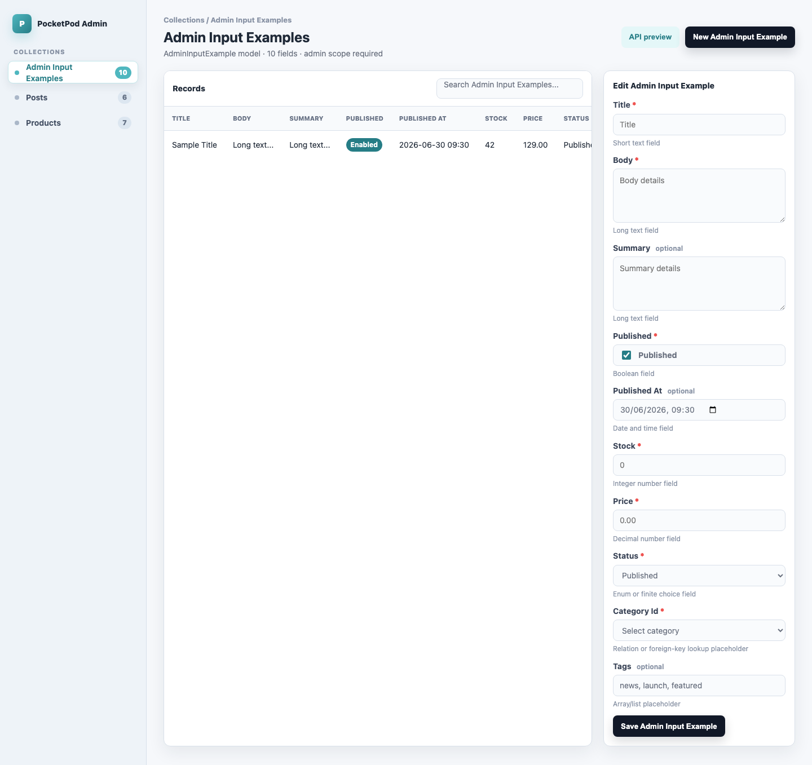

# PocketPod

PocketPod is a Serverpod + SQLite starter structure for a small single-server e-commerce/CMS backend.

It is not a new backend server. The backend is still Serverpod. PocketPod keeps the starter app, SQLite configuration, benchmark harness, and local Serverpod SQLite tuning patch together in one repository.

## Credits

PocketPod is built on top of [Serverpod](https://serverpod.dev), and the core framework, generated protocol model, endpoint runtime, client generation, and project structure all come from the Serverpod team's work.

This repository only adds a focused PocketPod layer around Serverpod for the SQLite use case: a starter layout, SQLite-oriented configuration, a small tuning patch in the copied Serverpod source, and benchmark tooling. The Serverpod team deserves full credit for the framework foundation that makes this possible.

PocketPod was also initially inspired by [PocketBase](https://pocketbase.io), especially its lightweight local SQLite deployment feel. PocketBase is not a dependency of PocketPod, but it helped frame the goal: keep deployment simple while preserving the Serverpod/Dart workflow.

The PocketPod admin generator borrows product-design direction from PocketBase's practical admin experience: fast CRUD navigation, dense data tables, clear collection/model editing, and a lightweight local-first feel. This is treated as design inspiration and credited clearly in the admin generator folder. PocketPod does not copy PocketBase source code, branding, icons, or visual assets.

PocketPod's current admin-generator advantage is that it turns Serverpod `.spy.yaml` model definitions into deterministic, typed Flutter admin source and a reviewable HTML preview. The generator now classifies fields into practical form controls: text inputs, textareas, checkboxes, datetime selectors, numeric inputs, enum dropdown placeholders, relation dropdown placeholders, and array/list placeholders. Required non-nullable fields are marked with a red `*`, while nullable fields show an optional affordance.

## Version

PocketPod version:

```text
0.1.0
```

Compatible Serverpod baseline:

```text
3.5.0-beta.10
```

Release tag:

```text
v0.1.0+serverpod.3.5.0-beta.10
```

We name PocketPod releases this way so PocketPod can make its own progress while still making the Serverpod source baseline explicit. The `0.1.0` part is PocketPod's version; the `+serverpod.3.5.0-beta.10` part identifies the compatible Serverpod baseline inside `serverpod-pocketpod`.

## Repository Layout

```text
pocketpod-starter/       canonical starter app/template
serverpod-pocketpod/     local Serverpod source copy with SQLite tuning
tool/automation/         repository maintenance scripts
```

## Main Directories

`pocketpod-starter` contains the app you start from:

```text
pocketpod_client/      generated Dart client package
pocketpod_server/      Serverpod backend configured for SQLite
pocketpod_flutter/     Flutter companion app
tool/admin_generator/  Serverpod model YAML to admin UI generator
tool/benchmarks/       benchmark runner and HTML report generator
system-summary.md      architecture, benchmark, and setup notes
```

## Admin Generator

The Phase 3 admin generator is the first PocketPod-specific product layer beyond SQLite tuning:



```sh
cd pocketpod-starter
dart run tool/admin_generator/yaml_to_admin.dart \
  --input tool/admin_generator/fixtures \
  --output tool/admin_generator/generated
```

The current generated preview and screenshot live at:

```text
pocketpod-starter/tool/admin_generator/generated/admin_preview.html
pocketpod-starter/tool/admin_generator/screenshots/admin-preview.png
```

The first real served admin screen is available when the starter server is running:

```text
http://localhost:8082/admin/index.html
```

It authenticates through Serverpod Auth and calls protected `Scope.admin` admin endpoints. The current served screen includes clickable collection navigation for Admin Input Examples, Products, and Posts, with server-provided sample rows and generated field/control metadata.

The preview currently demonstrates PocketPod's smart control mapping from Serverpod model YAML:

```text
short String fields   -> text input
long content fields   -> textarea
bool                  -> checkbox
DateTime              -> datetime selector
int / double          -> numeric input
enum-like fields      -> dropdown placeholder
foreign-key fields    -> relation dropdown placeholder
list fields           -> array/list placeholder
non-nullable fields   -> red required * marker
nullable fields       -> optional marker
```

`serverpod-pocketpod` contains the local Serverpod source copy used by the starter through path dependency overrides. The SQLite tuning patch is in:

```text
serverpod-pocketpod/packages/serverpod_database/lib/src/adapters/sqlite/sqlite_pool_manager.dart
```

## Current Workflow

Refresh the local starter metadata and dependency overrides from the repository root:

```sh
tool/automation/create_pocketpod_repos.sh
```

Refresh the local Serverpod source copy from `../ServerPod`:

```sh
tool/automation/create_pocketpod_repos.sh --force
```

Validate the starter:

```sh
cd pocketpod-starter
flutter pub get
flutter analyze
dart run tool/benchmarks/run_bench.dart --profile production --targets serverpod-sqlite-tuned
dart run tool/benchmarks/render_report.dart
```

Open the benchmark report at:

```text
pocketpod-starter/tool/benchmarks/results/benchmark-report.html
```
